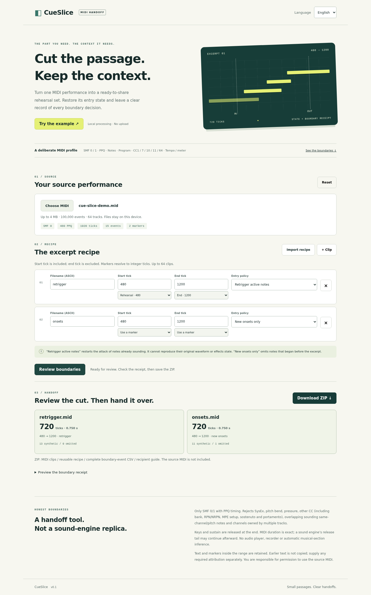

# CueSlice

**MIDI excerpt batches with reviewable entry state and exact MIDI boundaries.**

JA / EN · local-first browser app · native `.mid` downloads · source-bound JSON recipe

[Verified CI run](https://github.com/Masanori-Spec/cue-slice/actions/runs/37199838010) · [Evidence and limits](docs/VERIFICATION.md)



One MIDI performance often needs several rehearsal passages. CueSlice creates up
to 64 standalone SMF0 clips, restores supported entry state, and gives the recipient
a boundary-event ledger. It is a deliberate handoff workflow, not a DAW, waveform
cropper, or new note-chasing algorithm.

## Try locally

```sh
npm ci --ignore-scripts
npm run build
npm run serve
```

Open http://127.0.0.1:4173. Choose **Try the example** / **サンプルで試す** or load a
MIDI file. Set integer tick ranges or select source markers. Choose each clip's
entry policy, review the receipts, and download a ZIP. All processing stays in the
browser; no account, upload, analytics, external font, audio engine, or Web MIDI
permission is used. Files are held in memory; reload or Reset clears them.

Static deployment needs the contents of `dist/`. Relative assets work below a
subpath. HTTP localhost or HTTPS is required for Web Crypto source fingerprints.
No deployment or publication is performed by these build scripts.

## Output

- `clips/<name>.mid`: SMF type 0, source PPQ and channel numbers
- `excerpt-recipe.json`: tick-resolved batch, source SHA-256 and selected policies
- `boundary-events.csv`: every emitted event plus omitted boundary note decisions
- `recipient-guide.txt`: bilingual handoff summary, assumptions and limitations

The source MIDI is not copied into the ZIP. Reimporting the recipe verifies its
source SHA-256. User edits invalidate the old results before a new export is possible.
Identical source/recipe/name inputs produce byte-identical bundles.

### CLI

```sh
node scripts/clip.mjs performance.mid recipe.json out
```

```json
{
  "version": 1,
  "clips": [
    {
      "name": "passage-a",
      "startTick": 480,
      "endTick": 1200,
      "entryPolicy": "retrigger"
    },
    {
      "name": "passage-b",
      "startMarker": "Verse",
      "endMarker": "Chorus",
      "entryPolicy": "onsets"
    }
  ]
}
```

Marker names must have exactly one match; duplicate names are rejected. A boundary
must use a tick or marker, never both. Filenames use ASCII letters, digits, `_` and
`-`, start with a letter/digit, and are at most 48 characters. Duplicate filenames
are rejected case-insensitively for cross-platform handoff. Windows device
basenames CON, PRN, AUX, NUL, COM1–9 and LPT1–9 are also rejected in any case,
because adding `.mid` does not make them safe filenames.

## Boundary contract

- Range is **[start,end)**: events exactly at start are included; events at end are
  excluded and replaced with a defined closure when necessary
- Entry state considers events strictly before start. Tempo and time signature,
  then every source channel's program and CC1/7/10/11/64, are emitted before notes
- Unspecified defaults: tempo 500000 µs/quarter, 4/4, program 0, modulation 0,
  volume 100, pan 64, expression 127, sustain 0. There is no bank or GM reset
- `retrigger`: physically held notes restart at tick zero. A released key held by
  sustain is restored with note-on **then** note-off after sustain setup
- `onsets`: pre-boundary notes and their corresponding later note-offs are omitted
- Source note-off release velocities are preserved. Velocity-zero note-ons are
  represented as note-offs at velocity zero. Synthetic note-offs use velocity zero
- At end, held keys get note-offs and each source channel gets sustain release.
  End-of-track is exactly end−start ticks, preserving leading/trailing silence
- Text/meta types 1–9 inside the range are copied byte-for-byte. Earlier text is
  not copied. Provide required attribution separately. The ledger summarizes long
  metadata by type/byte count; the full metadata remains in the MIDI

**Retriggering restarts an attack. It cannot reproduce the original decaying
waveform, effects, bank state or external synth state. MIDI duration is exact;
release tails may continue after it.** Program selection is a raw MIDI number,
not a promise about the instrument a recipient's sound engine will choose.

## Supported profile and fail-closed limits

Inputs: SMF0 (one track) or SMF1, PPQ 1–32767. Notes, program change, CC1/7/10/11/64,
tempo, time signature and text/marker meta types 1–9. Track structure is flattened
into type0 output; original channels and deterministic event order are retained.

Rejected: SMPTE timing, type2, SysEx, pitch bend, channel/poly pressure, all other
CC including bank/RPN/NRPN/MPE setup/sostenuto/portamento, unknown metadata,
overlapping **sounding** same-channel/pitch notes (including pedal-held repeats),
unmatched note-offs, channels used across multiple source tracks, same-tick global
state in multiple tracks, malformed chunks/data/VLQ, and trailing bytes.
A note-only stream cannot be recognized as MPE; its unsupported expressive messages
are rejected when present. This strict subset rejects some otherwise valid MIDI.
Nothing unsupported is silently stripped to make a file import.

Bounds: 4MiB input, 100,000 source events (including EOT), 64 tracks, 64 clips,
8192 bytes per metadata event, maximum absolute tick 268435455, conservative
500,000-event batch budget including the per-clip conservative upper bound
`3 + channelCount × 391` (global setup/EOT plus channel setup, entry note pairs,
ending note-offs and sustain release), 32MiB clip-MIDI
budget and 40MiB total ZIP-entry budget. Recipe imports are limited to 256KiB in
the UI. Budget excess rejects the whole batch; it never emits a partial bundle.

## Verification

```sh
npm run check
python3 -m venv .venv
.venv/bin/python -m pip install -r tests/requirements.txt
.venv/bin/python tests/oracle.py
.venv/bin/python tests/native-consumer.py
# With a running local server and sandbox-capable Chromium:
npx playwright install chromium
PYTHON=.venv/bin/python npm run test:browser
```

See [verification status](docs/VERIFICATION.md), [native consumer notes](docs/NATIVE_CONSUMER.md),
[workflow comparison](docs/RESEARCH.md), and [security](SECURITY.md).

The source includes sandbox-on Chromium CI for ubuntu-22.04, desktop/mobile JA/EN, reviewed print screenshot/A4 PDF,
keyboard use, real downloads, independent Mido consumption, direct downloaded-ZIP
consumption by native FluidSynth, repeated exports,
source mismatches, failed imports and interrupted imports. The published application
revision passed all four CI jobs, including 17 browser scenarios and native
consumption of actual downloaded MIDI; exact evidence and remaining limits are
recorded in the verification status.

No project license has been selected. Third-party testing dependencies are listed
in [THIRD_PARTY_NOTICES.md](THIRD_PARTY_NOTICES.md); they are not bundled into the app.
